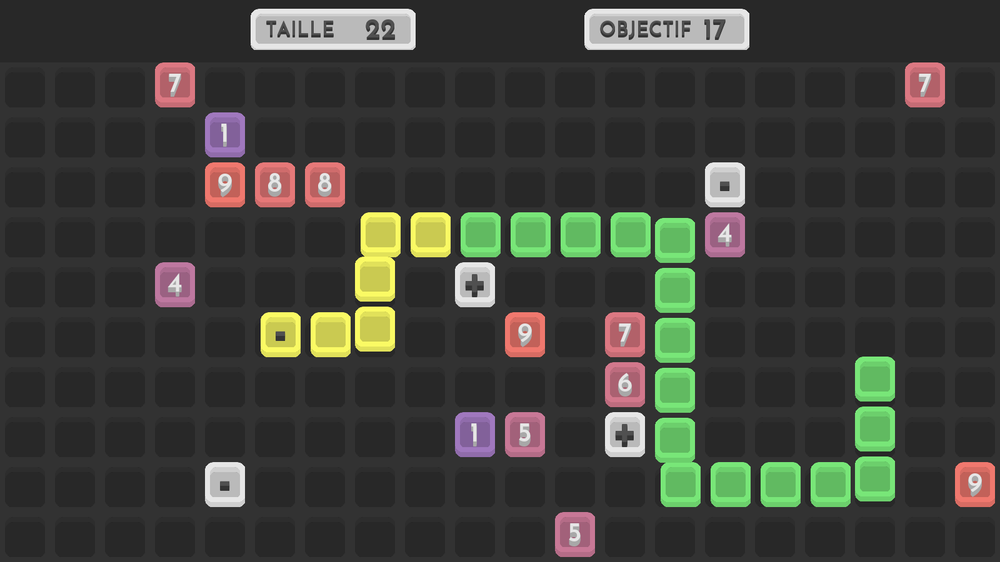

# SneakyMath



A mental arithmetic game inspired by the classic Snake. It is written in Python and uses the [pygame library](https://github.com/pygame/pygame). Visit the [itch.io page](https://lysquid.itch.io/sneakymath) for a more detailed presentation, in French.

## Running the game

Download the executable for your system in the Releases section.

On Linux, give execute permissions to the file and run it :

```bash
chmod +x SneakyMath
./SneakyMath
```

On Windows, run `SneakyMath.exe`

Alternatively, you can run the source code with Python after installing the library specified in the [requirements](requirements.txt). The main file is [sneakymath.py](sneakymath.py).

## How to play

You control the snake and you can eat the blocks on the grid. But here is the twist : your snake growth is based on the number written on the block you eat. Additionally, there are two operation modes, addition and subtraction, which is determined by the last operation block you ate. Depending on the operation mode you're in, your snake size will increase or decrease.

## Goal

Unlike the classic Snake, your goal is not to grow the biggest, but reached the exact size indicated as the goal on the top right of the screen. When you do so, parts of your snake turn to yellow to indicate they are full, and a new goal is generated, usually harder to reach! All of this while, of course, avoiding getting into the tail of your snake. At the end, your score is given by the number of yellow parts your snake has.

## Context

This game was created for the [Prix Bernard Novelli 2020](http://www.tropheestangente.com/PBN.php) and received an [acknowledgement](http://www.tropheestangente.com/palmares_2020.php).
